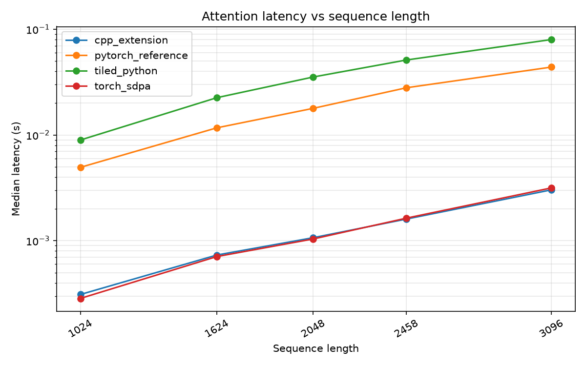
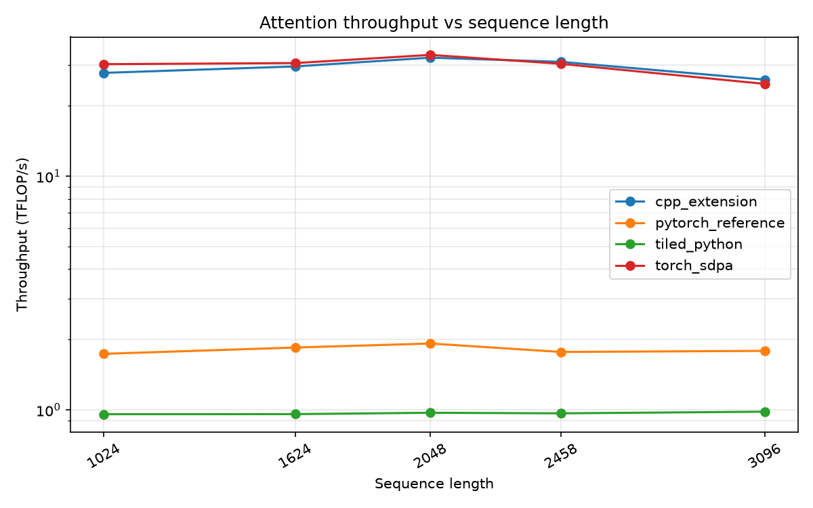
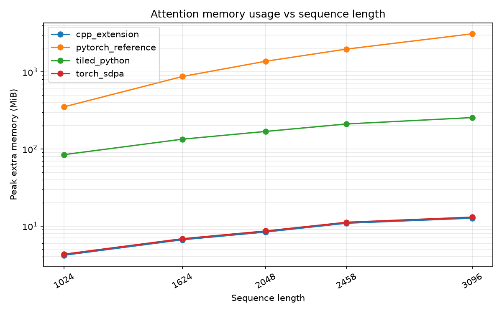

# Attention Benchmark Results

Config: B=4, H=8, D=64, causal=False, tile_size=64, device=cuda, dtype=torch.bfloat16, warmup=3, repeats=10.

## Latency (median, ms)

| seq_len | cpp_extension | pytorch_reference | tiled_python | torch_sdpa |
|---|---|---|---|---|
| 1024 | 0.310 | 4.946 | 8.966 | 0.285 |
| 1624 | 0.732 | 11.690 | 22.536 | 0.708 |
| 2048 | 1.068 | 17.872 | 35.362 | 1.039 |
| 2458 | 1.604 | 27.978 | 51.223 | 1.635 |
| 3096 | 3.030 | 43.905 | 79.967 | 3.161 |

## Throughput (TFLOP/s)

| seq_len | cpp_extension | pytorch_reference | tiled_python | torch_sdpa |
|---|---|---|---|---|
| 1024 | 27.694 | 1.737 | 0.958 | 30.175 |
| 1624 | 29.509 | 1.848 | 0.959 | 30.498 |
| 2048 | 32.171 | 1.923 | 0.972 | 33.066 |
| 2458 | 30.865 | 1.769 | 0.966 | 30.266 |
| 3096 | 25.915 | 1.788 | 0.982 | 24.843 |

## Peak extra memory (MiB)

| seq_len | cpp_extension | pytorch_reference | tiled_python | torch_sdpa |
|---|---|---|---|---|
| 1024 | 4.2 | 352.3 | 84.5 | 4.3 |
| 1624 | 6.7 | 870.7 | 134.1 | 6.9 |
| 2048 | 8.4 | 1375.7 | 169.1 | 8.7 |
| 2458 | 10.9 | 1976.3 | 211.3 | 11.2 |
| 3096 | 12.7 | 3119.0 | 255.6 | 13.1 |

---

Generated by `bench/plot_benchmark.py`. Raw data: `bench/results/benchmark_results.csv`.
